# Locked Decisions for Story 9db3ca85-ffdc-4a35-8719-f6dfb2a58ab3

## Implementation Approach
## Implementation Approach — Static Hand-Authored BigQuery DDL

### Strategy
Write all 116 DDL objects as static, hand-authored BigQuery Standard SQL across 9 files mirroring the source `hive/ddl/01-09` structure. No code generation — every CREATE statement is explicitly written with all type mappings, partitioning, clustering, descriptions, and options baked in. The authoritative source for column names, types, and ordinal positions is `manifests/tables.yaml`, cross-checked against `hive/ddl/01-08`.

### Output File Structure
All DDL files written to `/workspace/project/bigquery/ddl/`:

| File | Contents | Object Count |
|------|----------|-------------|
| `01-create-datasets.sql` | `CREATE SCHEMA` for `nbcs_staging`, `nbcs_ods`, `nbcs_dm` | 3 datasets |
| `02-staging-sqoop-mirrors.sql` | 27 sqoop mirror tables | 27 tables |
| `03-staging-delta-feeds.sql` | 8 CDC delta feed tables | 8 tables |
| `04-staging-file-feeds.sql` | 10 SFTP/file feed tables (JsonSerDe, RegexSerDe, SequenceFile, RCFile → standard) | 10 tables |
| `05-ods-cleanse.sql` | 15 cleansed/conformed tables | 15 tables |
| `06-ods-delta-scd2.sql` | 8 delta-merged + 3 SCD-2 history tables | 11 tables |
| `07-ods-acid.sql` | 4 former ACID tables → standard BQ tables with CLUSTER BY | 4 tables |
| `08-dm-tables.sql` | 9 dimensions + 9 facts + 7 aggregates | 25 tables |
| `09-dm-views.sql` | 13 regular views + 3 materialized views | 16 views |
| **Total** | | **116 + 3 datasets** |

### Key Technical Parameters

**Partitioning:**
- **Staging sqoop mirrors (27)**: `PARTITION BY DATE(load_date)` where `load_date` is a `DATE` column; `partition_expiration_days = 90`
- **Staging delta feeds (8)**: `PARTITION BY DATE(extract_ts)` where `extract_ts` is a `DATE` column; `partition_expiration_days = 90`
- **Staging file feeds (10)**: `PARTITION BY DATE(feed_date)` — Hive's `(client_code, feed_date)` dual-partition becomes single-column `feed_date` partition + `CLUSTER BY client_code`; `partition_expiration_days = 90`
- **`stg_wfm_schedule`**: Special case — Hive's `(load_date, site_code)` becomes `PARTITION BY DATE(load_date)` + `CLUSTER BY site_code`
- **ODS cleanse (15)**: `PARTITION BY DATE(snapshot_date/sched_date/event_date/call_date)` as appropriate per table
- **ODS delta-merged (8)**: `PARTITION BY DATE(work_month/period_month/event_date/swap_month/event_month/snapshot_date)` — STRING month columns like `work_month` ('YYYY-MM') are stored as `DATE` type (first of month) in BQ
- **ODS SCD-2 (3)**: `PARTITION BY RANGE_BUCKET(eff_from_year, GENERATE_ARRAY(2018, 2031, 1))`
- **ODS ACID (4)**: Unpartitioned, `CLUSTER BY` former bucketing key
- **DM dimensions (9)**: Unpartitioned (small tables)
- **DM facts with date_key (7)**: `PARTITION BY RANGE_BUCKET(date_key, GENERATE_ARRAY(20200101, 20301201, 100))`
- **`fact_billing_line`**: `PARTITION BY DATE(period_month)` + `CLUSTER BY (client_sk, program_sk)`
- **DM aggs**: Partitioned by their respective period column using same RANGE_BUCKET or DATE pattern

**Clustering (per locked Performance Optimization):**

| Table | CLUSTER BY |
|-------|-----------|
| `fact_interaction` | `channel, agent_sk, client_sk` |
| `fact_agent_activity` | `agent_sk, state_code` |
| `fact_queue_interval` | `queue_sk` |
| `fact_billing_line` | `client_sk, program_sk` |
| `fact_csat_survey` | `program_sk` |
| `agg_agent_daily` | `agent_sk` |
| `agg_billing_monthly` | `client_sk, program_sk` |
| File feed staging (10) | `client_code` |
| `stg_wfm_schedule` | `site_code` |
| `stg_tel_call` | `call_id` (preserves source bucketing intent) |
| ACID tables (4) | Former bucketing key (`client_id`, `agent_id`, `ticket_id`, `invoice_id`) |

### View Translation Strategy
All 15 views + 3 materialized views are hand-translated from Impala/Hive SQL to BigQuery Standard SQL. Key translations:

| Source Pattern | BigQuery Translation |
|---------------|---------------------|
| `NDV(x)` | `APPROX_COUNT_DISTINCT(x)` |
| `GROUPING__ID` + `WITH ROLLUP` | `GROUPING(col1, col2)` + `GROUP BY ROLLUP(...)` |
| `RLIKE 'pattern'` | `REGEXP_CONTAINS(col, r'pattern')` |
| `regexp_extract(s, p, 1)` | `REGEXP_EXTRACT(s, r'pattern')` with capture group |
| `unix_timestamp(ts)` | `UNIX_SECONDS(ts)` |
| `from_unixtime(x)` | `TIMESTAMP_SECONDS(x)` |
| `from_unixtime(x/1000)` | `TIMESTAMP_MILLIS(x)` |
| `date_add(ts, 7)` | `DATE_ADD(ts, INTERVAL 7 DAY)` |
| `WITH RECURSIVE` | `WITH RECURSIVE` (BQ native) |
| `PERCENT_RANK()`, `NTILE()` | Direct port (same syntax) |
| `staging.stg_crm_sla_target` (layer-skip) | `nbcs_staging.stg_crm_sla_target` (preserved as-is) |
| `CAST(s.issued_ts_sec / 1000 AS BIGINT)` (lie column) | `CAST(s.issued_ts_sec / 1000 AS INT64)` (preserved exactly) |

**Materialized views (3):**
- `vw_agent_scorecard` — materialized (complex multi-source join, frequent ops dashboard use)
- `vw_csat_rollup` — materialized (ROLLUP cube computation)
- `mv_agg_queue_hourly` — materialized (intraday-refreshed aggregate)

### Cross-Dataset References
All views use fully qualified `dataset.table` references. Cross-dataset reads:
- `vw_billing_reconciliation`: `nbcs_staging.stg_fin_invoice` JOIN `nbcs_ods.ods_invoice_acid`
- `vw_queue_sla_attainment`: reads `nbcs_staging.stg_crm_sla_target` (layer-skip preserved)
- `vw_agent_roster_current`: `nbcs_ods.ods_agent_scd2` + `nbcs_ods.ods_agent_assignment_scd2`
- `vw_shrinkage_analysis`: `nbcs_ods.ods_schedule` + `nbcs_dm.dim_agent`
- `vw_program_margin`: `nbcs_ods.ods_timesheet` + `nbcs_ods.ods_payroll_adjustment` + `nbcs_ods.ods_contract_line`

### ACID to Standard Table Conversion
The 4 ACID tables lose all transactional Hive properties:
- No `STORED AS ORC`, no `TBLPROPERTIES ('transactional'='true')`, no `INTO N BUCKETS`
- Each becomes a standard `CREATE TABLE` with `CLUSTER BY` on the former bucketing key
- BigQuery natively supports MERGE/UPDATE/DELETE on all tables

### SerDe Elimination
6 tables with non-standard storage:
- 3 JsonSerDe (`stg_file_qa_forms`, `stg_file_chat_transcripts`, `stg_file_speech_analytics`) → standard BQ tables with native `ARRAY`, `STRUCT`, `REPEATED` types
- 1 RegexSerDe (`stg_file_ivr_logs`) → standard BQ table with clean columns
- 1 SequenceFile (`stg_file_telco_invoice`) → standard BQ table
- 1 RCFile (`stg_file_dialer_result`) → standard BQ table
No format, SerDe, or TBLPROPERTIES references in any BQ DDL.

### Partition Column Type Handling
Hive partition columns defined as `STRING` in the source are converted to proper BQ types:
- `load_date STRING` → `load_date DATE` (BQ partition column)
- `extract_ts STRING` → `extract_ts DATE` (BQ partition column)
- `feed_date STRING` → `feed_date DATE` (BQ partition column)
- `client_code STRING` → `client_code STRING` (demoted from partition to `CLUSTER BY` column)
- `site_code STRING` → `site_code STRING` (demoted from partition to `CLUSTER BY` column)
- `snapshot_date STRING` → `snapshot_date DATE`
- `work_month STRING` → `work_month DATE` (stored as first-of-month)
- `period_month STRING` → `period_month DATE` (stored as first-of-month for DM tables using DATE partition; remains STRING where it is a regular column in staging)
- `eff_from_year INT` → `eff_from_year INT64` (RANGE partition)
- `date_key INT` → `date_key INT64` (RANGE partition)
- `channel STRING` → `channel STRING` (demoted from partition to `CLUSTER BY` column on `fact_interaction`)

## Data Mapping
## Data Mapping — Hive to BigQuery Type and Schema Translation

### Scope
100 tables (916 columns) translated 1:1 from Hive DDL to BigQuery DDL. No tables added, removed, split, or merged. Column names, ordinal positions, and logical meaning are preserved exactly. The translation is purely mechanical type mapping + partitioning adaptation + metadata propagation.

### Cross-Dataset Relationship Diagram
The ER diagram below shows the key cross-layer FK/PK join paths that must have matching types (AC5):

```mermaid
erDiagram
    stg_crm_client {
        INT64 client_id PK
        STRING client_code
        INT64 created_ts "epoch_sec"
    }
    stg_hr_agent {
        INT64 agent_id PK
        STRING employee_no
        INT64 hire_ts "epoch_sec"
    }
    stg_fin_invoice {
        INT64 invoice_id PK
        INT64 issued_ts_sec "lie_ms - values are MILLIS"
        NUMERIC total_amount "precision 14,2"
    }
    stg_tel_queue {
        INT64 queue_id PK
        INT64 program_id FK
    }
    stg_file_qa_forms {
        STRING qa_form_id PK
        INT64 evaluated_ms "epoch_ms"
        ARRAY sections "STRUCT section_code max_points scored_points"
    }
    stg_file_chat_transcripts {
        STRING chat_ref PK
        ARRAY messages "STRUCT sender ts_ms text"
        ARRAY metadata "STRUCT key value - was MAP"
    }
    ods_client_acid {
        INT64 client_id PK
        TIMESTAMP created_ts
        STRING status
    }
    ods_agent_acid {
        INT64 agent_id PK
        TIMESTAMP hire_ts
        STRING status
    }
    ods_invoice_acid {
        INT64 invoice_id PK
        TIMESTAMP issued_ts
        NUMERIC total_amount "precision 14,2"
    }
    ods_agent_scd2 {
        STRING agent_history_id PK
        INT64 agent_id
        INT64 eff_from_year "RANGE partition"
    }
    ods_program {
        INT64 program_id PK
        INT64 client_id
    }
    ods_queue {
        INT64 queue_id PK
        INT64 program_id
    }
    dim_client {
        INT64 client_sk PK
        INT64 client_id
        STRING client_code
    }
    dim_agent {
        INT64 agent_sk PK
        INT64 agent_id
        BOOL is_current
    }
    dim_program {
        INT64 program_sk PK
        INT64 program_id
        INT64 client_id
    }
    dim_queue {
        INT64 queue_sk PK
        INT64 queue_id
        INT64 program_id
    }
    fact_interaction {
        STRING interaction_id PK
        INT64 agent_sk FK
        INT64 client_sk FK
        INT64 program_sk FK
        INT64 queue_sk FK
        INT64 date_key "RANGE partition monthly"
        STRING channel "CLUSTER col"
    }
    fact_billing_line {
        INT64 invoice_line_id PK
        INT64 client_sk FK
        INT64 program_sk FK
        STRING period_month "DATE partition"
    }
    fact_csat_survey {
        STRING survey_id PK
        INT64 agent_sk FK
        INT64 program_sk FK
        INT64 date_key "RANGE partition monthly"
    }
    fact_qa_evaluation {
        STRING qa_form_id PK
        INT64 agent_sk FK
        INT64 program_sk FK
        INT64 date_key "RANGE partition monthly"
    }

    stg_crm_client ||--|| ods_client_acid : "client_id"
    stg_hr_agent ||--|| ods_agent_acid : "agent_id"
    stg_fin_invoice ||--|| ods_invoice_acid : "invoice_id"
    stg_tel_queue ||--|| ods_queue : "queue_id"
    ods_client_acid ||--|| dim_client : "client_id"
    ods_agent_scd2 ||--|| dim_agent : "agent_id"
    ods_program ||--|| dim_program : "program_id"
    ods_queue ||--|| dim_queue : "queue_id"
    dim_agent ||--o{ fact_interaction : "agent_sk"
    dim_client ||--o{ fact_interaction : "client_sk"
    dim_program ||--o{ fact_interaction : "program_sk"
    dim_queue ||--o{ fact_interaction : "queue_sk"
    dim_client ||--o{ fact_billing_line : "client_sk"
    dim_program ||--o{ fact_billing_line : "program_sk"
    dim_agent ||--o{ fact_csat_survey : "agent_sk"
    dim_program ||--o{ fact_csat_survey : "program_sk"
    dim_agent ||--o{ fact_qa_evaluation : "agent_sk"
    dim_program ||--o{ fact_qa_evaluation : "program_sk"
```

### Primitive Type Mapping Rules

| Hive Type | BigQuery Type | Column Count | Notes |
|-----------|--------------|-------------|-------|
| `BIGINT` | `INT64` | ~400+ | Includes all epoch columns — kept as INT64 in staging per EPOCH-POLICY.md |
| `INT` | `INT64` | ~80+ | BQ has no INT32; all INT to INT64 |
| `STRING` | `STRING` | ~300+ | Direct mapping |
| `BOOLEAN` | `BOOL` | ~40+ | Direct mapping |
| `TIMESTAMP` | `TIMESTAMP` | ~60+ | ODS/DM layer only (staging uses epoch INT64) |
| `DOUBLE` | `FLOAT64` | 2 | `stg_file_speech_analytics.sentiment_score`, `.silence_pct` |
| `DECIMAL(12,4)` | `NUMERIC(12,4)` | ~15 | `unit_rate`, `rate`, `old_rate`, `new_rate` columns |
| `DECIMAL(14,2)` | `NUMERIC(14,2)` | ~10 | `total_amount`, `line_amount`, `billed_amount`, `net_revenue` |
| `DECIMAL(12,2)` | `NUMERIC(12,2)` | ~12 | `min_commit`, `amount`, `credit_amount`, `charge_amount`, `sla_credit_amount`, `telco_cost_amount` |
| `DECIMAL(10,4)` | `NUMERIC(10,4)` | ~2 | `target_value` |
| `DECIMAL(5,2)` | `NUMERIC(5,2)` | ~8 | `overall_pct`, `adherence_pct`, `occupancy_pct`, `avg_csat`, `pct_promoters`, `pct_detractors`, `sl_pct` |
| `DECIMAL(8,2)` | `NUMERIC(8,2)` | ~5 | `required_fte`, `avg_speed_answer_sec`, `avg_handle_sec`, `avg_handle_seconds` |
| `DECIMAL(7,2)` | `NUMERIC(7,2)` | ~1 | `volume_variance_pct` |

### Complex Type Mapping

| Column | Hive Type | BigQuery Type |
|--------|-----------|--------------|
| `stg_file_qa_forms.sections` | `ARRAY<STRUCT<section_code:STRING, max_points:INT, scored_points:INT>>` | `ARRAY<STRUCT<section_code STRING, max_points INT64, scored_points INT64>>` (INT to INT64 inside struct) |
| `stg_file_chat_transcripts.messages` | `ARRAY<STRUCT<sender:STRING, ts_ms:BIGINT, text:STRING>>` | `ARRAY<STRUCT<sender STRING, ts_ms INT64, text STRING>>` (BIGINT to INT64 inside struct) |
| `stg_file_chat_transcripts.metadata` | `MAP<STRING,STRING>` | `ARRAY<STRUCT<key STRING, value STRING>>` (MAP to ARRAY of key-value STRUCT) |
| `stg_file_speech_analytics.keywords` | `ARRAY<STRING>` | `ARRAY<STRING>` (mode REPEATED, direct mapping) |

### Special Column Handling

**56 epoch BIGINT columns in staging — all remain INT64:**
Per locked EPOCH-POLICY.md, no epoch column in staging is cast to TIMESTAMP. They stay as INT64 with BQ column descriptions documenting the unit:
- `*_epoch`, `*_ts` (from telephony/WFM/HR/CRM): description includes `'epoch SECONDS (legacy)'`
- `*_ms`, `change_ms`: description includes `'epoch MILLISECONDS (legacy)'`
- Columns with name containing `_sec`, `_ms`, `_epoch` get unit documentation in description

**2 lie_ms columns:**
- `stg_fin_invoice.issued_ts_sec` — INT64, description: `'!! name says seconds, VALUES ARE MILLIS !!'`
- `stg_fin_invoice.due_ts_sec` — INT64, description: `'!! name says seconds, VALUES ARE MILLIS !!'`

**4 Oracle string date columns:**
- `stg_crm_contract.start_dt` — STRING, description: `'Oracle string YYYYMMDDHH24MISS (legacy)'`
- `stg_crm_contract.end_dt` — STRING, description: `'Oracle string YYYYMMDDHH24MISS (legacy)'`
- `stg_crm_contract.signed_dt` — STRING, description: `'Oracle string YYYYMMDDHH24MISS (legacy)'`
- `stg_crm_contract_line.effective_dt` — STRING, description: `'Oracle string YYYYMMDDHH24MISS (legacy)'`

**68 COMMENT annotations to BQ column descriptions:**
All Hive `COMMENT` strings from staging DDL files (42 in sqoop mirrors, 12 in delta feeds, 14 in file feeds) are carried to BigQuery column `OPTIONS(description=...)`. This includes:
- `'epoch SECONDS (legacy)'` on all epoch_sec columns
- `'epoch MILLISECONDS (legacy)'` on all epoch_ms columns
- `'!! name says seconds, VALUES ARE MILLIS !!'` on the 2 lie columns

### Partition Column Promotion
In Hive, partition columns are metadata-only (not in data files). In BigQuery, partition columns are regular columns in the table schema. The DDL includes partition columns in the column list with proper types:
- `load_date`, `extract_ts`, `feed_date`, `snapshot_date`, `sched_date`, `event_date`, `call_date` → `DATE` type
- `client_code`, `site_code` (demoted from multi-col partition) → `STRING`, placed in CLUSTER BY
- `date_key`, `week_start_key` → `INT64` (RANGE_BUCKET partition)
- `channel` → `STRING` (demoted to CLUSTER BY on `fact_interaction`)
- `period_month` → `DATE` where used as partition column; `STRING` where a regular column in staging
- `eff_from_year` → `INT64` (RANGE_BUCKET partition)
- `work_month`, `swap_month`, `event_month` → `DATE` where used as partition column

### Reserved Word Safety
All ~916 column names checked against BQ reserved word list. No collisions expected — column names like `status`, `date_key`, `type` are not BQ reserved words when used as identifiers in CREATE TABLE DDL.

## Validation
## Validation — Live BigQuery Catalog Verification (9 Acceptance Criteria)

### Validation Environment
All validation runs against **live BigQuery scratch datasets** — never offline parse, dry-run, or static analysis. The scratch datasets are created by the DDL scripts themselves (`nbcs_staging`, `nbcs_ods`, `nbcs_dm`). Every check queries `INFORMATION_SCHEMA` or executes `SELECT` against the actual catalog.

### Validation Script
A single validation SQL script (`/workspace/project/bigquery/validation/validate-schema.sql`) executes all checks sequentially after DDL application. Results are reported per acceptance criterion with PASS/FAIL and specific failure details.

### AC1 — DDL Error-Free Application (116/116 objects)
**Method:** Execute each of the 9 DDL files in order (01 through 09) against the scratch project. Each `CREATE` statement must succeed with 0 errors.
- 3 `CREATE SCHEMA` statements
- 100 `CREATE TABLE` statements
- 13 `CREATE VIEW` statements
- 3 `CREATE MATERIALIZED VIEW` statements
- Any BQ error message on any statement is a HARD FAIL naming the object and error.
- The 4 former ACID tables must create as standard tables with no transactional syntax.
- The 6 former SerDe tables must create with no format/SerDe references.

**Pass criterion:** 116/116 objects created, 0 DDL errors.

### AC2 — Per-Column Fidelity (916/916 columns)
**Method:** Query `INFORMATION_SCHEMA.COLUMNS` for all 100 tables across 3 datasets and compare each column against `manifests/tables.yaml`.

Checks per column:
1. **Name** matches exactly (case-sensitive)
2. **Ordinal position** matches source order (regular columns first, then partition columns promoted to end)
3. **Mapped type** matches the type mapping rules:
   - BIGINT/INT → INT64
   - STRING → STRING
   - BOOLEAN → BOOL
   - TIMESTAMP → TIMESTAMP
   - DOUBLE → FLOAT64
   - DECIMAL(p,s) → NUMERIC(p,s) with exact precision/scale
4. **Nested sub-fields** verified recursively for all 5 complex columns:
   - `stg_file_qa_forms.sections`: 3 sub-fields, INT→INT64
   - `stg_file_chat_transcripts.messages`: 3 sub-fields, BIGINT→INT64
   - `stg_file_chat_transcripts.metadata`: 2 sub-fields (MAP→ARRAY of STRUCT)
   - `stg_file_speech_analytics.keywords`: REPEATED STRING mode
5. **Column descriptions** present and matching for all 68 annotated columns + 4 Oracle string columns + 2 lie columns
6. **Epoch columns** (56 total) remain INT64, not TIMESTAMP
7. **DECIMAL precision/scale** exact for all 53 DECIMAL columns across 7 signatures

**Pass criterion:** 916/916 columns across 100/100 tables, 0 mismatches.

### AC3 — Object-Type Fidelity (116/116 correct type)
**Method:** Query `INFORMATION_SCHEMA.TABLES` for all 3 datasets. Verify:
- 100 objects have `table_type = 'BASE TABLE'` (including 4 former ACID tables)
- 13 objects have `table_type = 'VIEW'`
- 3 objects have `table_type = 'MATERIALIZED VIEW'` (`vw_agent_scorecard`, `vw_csat_rollup`, `mv_agg_queue_hourly`)
- No silent type flips (table created as view or view created as table)

**Pass criterion:** 100 BASE TABLE + 13 VIEW + 3 MATERIALIZED VIEW = 116 correct types.

### AC4 — Partition + Cluster + Key Intent (100/100 tables)
**Method:** Query `INFORMATION_SCHEMA.COLUMNS` (for `is_partitioning_column`) and `INFORMATION_SCHEMA.TABLE_OPTIONS` (for `partition_expiration_days`) to verify each table's partition column, partition type, clustering columns, and expiration.

Key verifications:
- 27 staging sqoop mirrors: partitioned by `load_date` DATE, expiration = 90 days
- `stg_wfm_schedule`: partitioned by `load_date`, clustered by `site_code`
- 8 staging deltas: partitioned by `extract_ts` DATE, expiration = 90 days
- 10 staging file feeds: partitioned by `feed_date` DATE, clustered by `client_code`, expiration = 90 days
- 15 ODS cleanse: partitioned by respective date columns
- 8 ODS delta-merged: partitioned by period/date column
- 3 ODS SCD-2: RANGE partitioned by `eff_from_year`
- 4 ODS ACID: unpartitioned, clustered by former bucketing key
- 9 DM dims: unpartitioned
- 7 DM facts with date_key: RANGE partitioned with monthly boundaries
- `fact_billing_line`: DATE partitioned by `period_month`, clustered by `client_sk, program_sk`
- 7 DM aggs: partitioned by respective period column
- Clustering verified on all 7 hot-path tables per locked Performance Optimization

**Pass criterion:** 100/100 tables match the partition/cluster matrix.

### AC5 — Cross-Dataset FK/PK Type Consistency
**Method:** Query `INFORMATION_SCHEMA.COLUMNS` for join-path column pairs and verify data_type matches on both sides.

Join paths to verify:
- **staging to ods:** `client_id` (INT64=INT64), `agent_id`, `program_id`, `ticket_id`, `invoice_id`, `queue_id`, `org_unit_id` — 7 pairs
- **ods to dm:** `agent_id`, `program_id`, `queue_id`, `client_id` — 4 pairs
- **dm surrogate keys:** `agent_sk`, `client_sk`, `program_sk`, `queue_sk` across fact to dim — 8+ pairs
- **Cross-layer view joins:** `vw_queue_sla_attainment` (dm to staging), `vw_billing_reconciliation` (staging to ods), `vw_shrinkage_analysis` (dm to ods) — 3 pairs

**Pass criterion:** All documented FK/PK join paths have matching types, 0 mismatches.

### AC6 — Queryability Smoke (115/115 + 3/3 cross-joins)
**Method:** Execute `SELECT * FROM <object> LIMIT 0` for all 100 tables and 15 views/MVs. This validates schema correctness and view SQL compilation without requiring data.

Plus 3 representative cross-join queries:
1. `nbcs_staging`: `stg_fin_invoice` JOIN `stg_fin_invoice_line` ON `invoice_id`
2. `nbcs_ods`: `ods_interaction` JOIN `ods_call` using CAST pattern
3. `nbcs_dm`: `fact_interaction` JOIN `dim_agent` JOIN `dim_program` on surrogate keys

**Pass criterion:** 115 SELECT * succeed, 3 cross-join queries execute with 0 errors.

### AC7 — Integrity Guards (116/116 catalog-readable)
**Method:** After all DDL applied, verify every object appears in `INFORMATION_SCHEMA.TABLES` and every column appears in `INFORMATION_SCHEMA.COLUMNS`. Absence of an object or column is a HARD FAIL.

Anti-pattern enforcement: a violation-finding query returning 0 rows is NOT proof of no violation if the object itself is absent. Both sides absent = HARD FAIL for required structural objects.

**Pass criterion:** 116/116 objects catalog-readable, 916/916 columns catalog-readable, 0 integrity violations.

### AC8 — No-Silent-Skip (116/116 live-checked)
**Method:** Every criterion (AC1-AC7, AC9) is proven by executing BQ SQL against the live catalog. No offline parse, no dry-run, no sampling, no representative subset.

The validation script outputs a manifest of all 116 objects checked and all 916 columns verified, with per-object status. Any object not individually checked is a FAIL.

**Pass criterion:** 116/116 objects and 916/916 columns verified via live catalog queries, 0 skipped.

### AC9 — Physical-Access Performance (scan reduction)
**Method:** Load fixture data from `data/parquet/` and `data/text/` into 7 hot-path clustered tables + 1 staging table. For each, run a filtered query AND unfiltered equivalent, capturing `totalBytesProcessed` from BQ job metadata.

Tables and filter patterns:
1. `fact_interaction` — filter by `date_key` range + `channel` vs unfiltered
2. `fact_agent_activity` — filter by `agent_sk` vs unfiltered
3. `fact_queue_interval` — filter by `queue_sk` vs unfiltered
4. `fact_billing_line` — filter by `client_sk` + `program_sk` vs unfiltered
5. `agg_agent_daily` — filter by `agent_sk` vs unfiltered
6. `agg_billing_monthly` — filter by `client_sk` + `program_sk` vs unfiltered
7. `stg_tel_call` — filter by `load_date` partition vs unfiltered

All bytes-scanned figures from actual BQ job metadata (`totalBytesProcessed`), never invented. Filtered queries must scan materially fewer bytes than unfiltered.

**Pass criterion:** 7/7 hot-path + 1 staging — every filtered query scans fewer bytes.

### Validation Execution Order
1. Run DDL files 01-09 in sequence (AC1)
2. Run catalog verification queries (AC2, AC3, AC4, AC5, AC7)
3. Run queryability smoke tests (AC6)
4. Load fixture data and run performance benchmarks (AC9)
5. Generate summary report with per-AC pass/fail status (AC8 — ensures no skips)
