# Data Mapping

## Data Mapping — Hive to BigQuery Type and Schema Translation

### Scope
100 tables (916 columns) translated 1:1 from Hive DDL to BigQuery DDL. No tables added, removed, split, or merged. Column names, ordinal positions, and logical meaning are preserved exactly. The translation is purely mechanical type mapping + partitioning adaptation + metadata propagation.

### Cross-Dataset Relationship Diagram
The ER diagram below shows the key cross-layer FK/PK join paths that must have matching types (AC5):

```mermaid
erDiagram
    stg_crm_client {
        INT64 client_id PK
        STRING client_code
        INT64 created_ts "epoch_sec"
    }
    stg_hr_agent {
        INT64 agent_id PK
        STRING employee_no
        INT64 hire_ts "epoch_sec"
    }
    stg_fin_invoice {
        INT64 invoice_id PK
        INT64 issued_ts_sec "lie_ms - values are MILLIS"
        NUMERIC total_amount "precision 14,2"
    }
    stg_tel_queue {
        INT64 queue_id PK
        INT64 program_id FK
    }
    stg_file_qa_forms {
        STRING qa_form_id PK
        INT64 evaluated_ms "epoch_ms"
        ARRAY sections "STRUCT section_code max_points scored_points"
    }
    stg_file_chat_transcripts {
        STRING chat_ref PK
        ARRAY messages "STRUCT sender ts_ms text"
        ARRAY metadata "STRUCT key value - was MAP"
    }
    ods_client_acid {
        INT64 client_id PK
        TIMESTAMP created_ts
        STRING status
    }
    ods_agent_acid {
        INT64 agent_id PK
        TIMESTAMP hire_ts
        STRING status
    }
    ods_invoice_acid {
        INT64 invoice_id PK
        TIMESTAMP issued_ts
        NUMERIC total_amount "precision 14,2"
    }
    ods_agent_scd2 {
        STRING agent_history_id PK
        INT64 agent_id
        INT64 eff_from_year "RANGE partition"
    }
    ods_program {
        INT64 program_id PK
        INT64 client_id
    }
    ods_queue {
        INT64 queue_id PK
        INT64 program_id
    }
    dim_client {
        INT64 client_sk PK
        INT64 client_id
        STRING client_code
    }
    dim_agent {
        INT64 agent_sk PK
        INT64 agent_id
        BOOL is_current
    }
    dim_program {
        INT64 program_sk PK
        INT64 program_id
        INT64 client_id
    }
    dim_queue {
        INT64 queue_sk PK
        INT64 queue_id
        INT64 program_id
    }
    fact_interaction {
        STRING interaction_id PK
        INT64 agent_sk FK
        INT64 client_sk FK
        INT64 program_sk FK
        INT64 queue_sk FK
        INT64 date_key "RANGE partition monthly"
        STRING channel "CLUSTER col"
    }
    fact_billing_line {
        INT64 invoice_line_id PK
        INT64 client_sk FK
        INT64 program_sk FK
        STRING period_month "DATE partition"
    }
    fact_csat_survey {
        STRING survey_id PK
        INT64 agent_sk FK
        INT64 program_sk FK
        INT64 date_key "RANGE partition monthly"
    }
    fact_qa_evaluation {
        STRING qa_form_id PK
        INT64 agent_sk FK
        INT64 program_sk FK
        INT64 date_key "RANGE partition monthly"
    }

    stg_crm_client ||--|| ods_client_acid : "client_id"
    stg_hr_agent ||--|| ods_agent_acid : "agent_id"
    stg_fin_invoice ||--|| ods_invoice_acid : "invoice_id"
    stg_tel_queue ||--|| ods_queue : "queue_id"
    ods_client_acid ||--|| dim_client : "client_id"
    ods_agent_scd2 ||--|| dim_agent : "agent_id"
    ods_program ||--|| dim_program : "program_id"
    ods_queue ||--|| dim_queue : "queue_id"
    dim_agent ||--o{ fact_interaction : "agent_sk"
    dim_client ||--o{ fact_interaction : "client_sk"
    dim_program ||--o{ fact_interaction : "program_sk"
    dim_queue ||--o{ fact_interaction : "queue_sk"
    dim_client ||--o{ fact_billing_line : "client_sk"
    dim_program ||--o{ fact_billing_line : "program_sk"
    dim_agent ||--o{ fact_csat_survey : "agent_sk"
    dim_program ||--o{ fact_csat_survey : "program_sk"
    dim_agent ||--o{ fact_qa_evaluation : "agent_sk"
    dim_program ||--o{ fact_qa_evaluation : "program_sk"
```

### Primitive Type Mapping Rules

| Hive Type | BigQuery Type | Column Count | Notes |
|-----------|--------------|-------------|-------|
| `BIGINT` | `INT64` | ~400+ | Includes all epoch columns — kept as INT64 in staging per EPOCH-POLICY.md |
| `INT` | `INT64` | ~80+ | BQ has no INT32; all INT to INT64 |
| `STRING` | `STRING` | ~300+ | Direct mapping |
| `BOOLEAN` | `BOOL` | ~40+ | Direct mapping |
| `TIMESTAMP` | `TIMESTAMP` | ~60+ | ODS/DM layer only (staging uses epoch INT64) |
| `DOUBLE` | `FLOAT64` | 2 | `stg_file_speech_analytics.sentiment_score`, `.silence_pct` |
| `DECIMAL(12,4)` | `NUMERIC(12,4)` | ~15 | `unit_rate`, `rate`, `old_rate`, `new_rate` columns |
| `DECIMAL(14,2)` | `NUMERIC(14,2)` | ~10 | `total_amount`, `line_amount`, `billed_amount`, `net_revenue` |
| `DECIMAL(12,2)` | `NUMERIC(12,2)` | ~12 | `min_commit`, `amount`, `credit_amount`, `charge_amount`, `sla_credit_amount`, `telco_cost_amount` |
| `DECIMAL(10,4)` | `NUMERIC(10,4)` | ~2 | `target_value` |
| `DECIMAL(5,2)` | `NUMERIC(5,2)` | ~8 | `overall_pct`, `adherence_pct`, `occupancy_pct`, `avg_csat`, `pct_promoters`, `pct_detractors`, `sl_pct` |
| `DECIMAL(8,2)` | `NUMERIC(8,2)` | ~5 | `required_fte`, `avg_speed_answer_sec`, `avg_handle_sec`, `avg_handle_seconds` |
| `DECIMAL(7,2)` | `NUMERIC(7,2)` | ~1 | `volume_variance_pct` |

### Complex Type Mapping

| Column | Hive Type | BigQuery Type |
|--------|-----------|--------------|
| `stg_file_qa_forms.sections` | `ARRAY<STRUCT<section_code:STRING, max_points:INT, scored_points:INT>>` | `ARRAY<STRUCT<section_code STRING, max_points INT64, scored_points INT64>>` (INT to INT64 inside struct) |
| `stg_file_chat_transcripts.messages` | `ARRAY<STRUCT<sender:STRING, ts_ms:BIGINT, text:STRING>>` | `ARRAY<STRUCT<sender STRING, ts_ms INT64, text STRING>>` (BIGINT to INT64 inside struct) |
| `stg_file_chat_transcripts.metadata` | `MAP<STRING,STRING>` | `ARRAY<STRUCT<key STRING, value STRING>>` (MAP to ARRAY of key-value STRUCT) |
| `stg_file_speech_analytics.keywords` | `ARRAY<STRING>` | `ARRAY<STRING>` (mode REPEATED, direct mapping) |

### Special Column Handling

**56 epoch BIGINT columns in staging — all remain INT64:**
Per locked EPOCH-POLICY.md, no epoch column in staging is cast to TIMESTAMP. They stay as INT64 with BQ column descriptions documenting the unit:
- `*_epoch`, `*_ts` (from telephony/WFM/HR/CRM): description includes `'epoch SECONDS (legacy)'`
- `*_ms`, `change_ms`: description includes `'epoch MILLISECONDS (legacy)'`
- Columns with name containing `_sec`, `_ms`, `_epoch` get unit documentation in description

**2 lie_ms columns:**
- `stg_fin_invoice.issued_ts_sec` — INT64, description: `'!! name says seconds, VALUES ARE MILLIS !!'`
- `stg_fin_invoice.due_ts_sec` — INT64, description: `'!! name says seconds, VALUES ARE MILLIS !!'`

**4 Oracle string date columns:**
- `stg_crm_contract.start_dt` — STRING, description: `'Oracle string YYYYMMDDHH24MISS (legacy)'`
- `stg_crm_contract.end_dt` — STRING, description: `'Oracle string YYYYMMDDHH24MISS (legacy)'`
- `stg_crm_contract.signed_dt` — STRING, description: `'Oracle string YYYYMMDDHH24MISS (legacy)'`
- `stg_crm_contract_line.effective_dt` — STRING, description: `'Oracle string YYYYMMDDHH24MISS (legacy)'`

**68 COMMENT annotations to BQ column descriptions:**
All Hive `COMMENT` strings from staging DDL files (42 in sqoop mirrors, 12 in delta feeds, 14 in file feeds) are carried to BigQuery column `OPTIONS(description=...)`. This includes:
- `'epoch SECONDS (legacy)'` on all epoch_sec columns
- `'epoch MILLISECONDS (legacy)'` on all epoch_ms columns
- `'!! name says seconds, VALUES ARE MILLIS !!'` on the 2 lie columns

### Partition Column Promotion
In Hive, partition columns are metadata-only (not in data files). In BigQuery, partition columns are regular columns in the table schema. The DDL includes partition columns in the column list with proper types:
- `load_date`, `extract_ts`, `feed_date`, `snapshot_date`, `sched_date`, `event_date`, `call_date` → `DATE` type
- `client_code`, `site_code` (demoted from multi-col partition) → `STRING`, placed in CLUSTER BY
- `date_key`, `week_start_key` → `INT64` (RANGE_BUCKET partition)
- `channel` → `STRING` (demoted to CLUSTER BY on `fact_interaction`)
- `period_month` → `DATE` where used as partition column; `STRING` where a regular column in staging
- `eff_from_year` → `INT64` (RANGE_BUCKET partition)
- `work_month`, `swap_month`, `event_month` → `DATE` where used as partition column

### Reserved Word Safety
All ~916 column names checked against BQ reserved word list. No collisions expected — column names like `status`, `date_key`, `type` are not BQ reserved words when used as identifiers in CREATE TABLE DDL.
